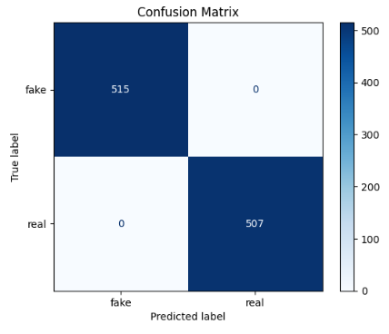
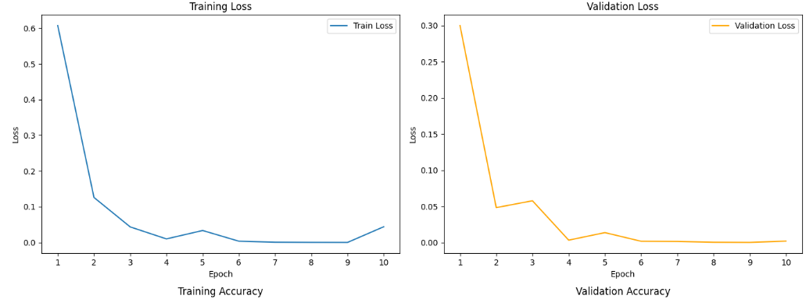
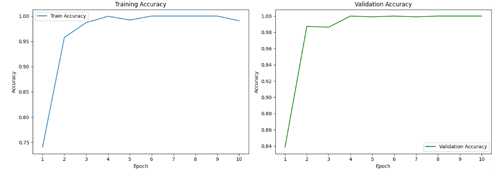
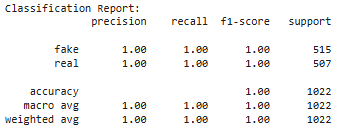

# CNN-BASED-DEEPFAKE-CLASSIFICATION
A CNN-based model for classifying images as real or deepfake. It uses extracted video frames to train a neural network that detects visual inconsistencies caused by manipulation, enabling accurate and automated deepfake detection.
# CNN-Based Deepfake Classification

A deep learning project using Convolutional Neural Networks (CNNs) to classify images as real or deepfake based on extracted video frames.

## 📂 Dataset
This project implements a Convolutional Neural Network (CNN) for deepfake image classification. It uses frames extracted from videos in the Celeb-DF v2 dataset. From the original dataset, a subsample of 5110 frames was selected for training and validation, evenly split between real and fake classes.The CNN model consists of three convolutional layers with PReLU activations and max-pooling, followed by a fully connected layer with sigmoid activation to output a binary classification score. The input images are resized to 128x128 pixels to standardize the input size.Training is done using the Adam optimizer with an L1 loss function, over 10 epochs, with a batch size of 32. The dataset is split into 80% training and 20% validation subsets to monitor model performance. After training, evaluation metrics including classification report and confusion matrix visualize the model’s accuracy and effectiveness in detecting deepfakes.

This approach demonstrates a lightweight yet effective deep learning solution for automated deepfake detection using image frames.
- Structured into two classes: `real` and `fake`
- Images are extracted frames from video clips

## 🧠 Model

- CNN architecture with 3 convolutional layers
- PReLU activations and max-pooling
- Fully connected layer with sigmoid output

## ⚙️ Training Details

- Image size: 128x128
- Batch size: 32
- Loss function: L1Loss
- Optimizer: Adam
- Epochs: 10

## 📊 Evaluation

- Metrics: Accuracy, Confusion Matrix, Classification Report
- Visualization with matplotlib
# CNN-Based Deepfake Classification

## 📊 Results

### Confusion Matrix

### Training Curves

### Metric Summary

